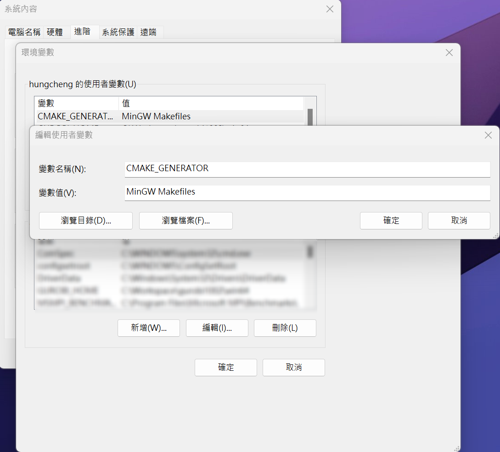

# 用python 調用 llama.cpp

本教程旨在指導讀者通過一個基於Python的封裝，逐步了解如何在本地機器上運行和利用llama.cpp，一個強大的C++庫，用於操作大語言模型。
# 安裝指南

## 使用 Ubuntu 或 Windows WSL
如果您使用的是 Ubuntu 或 Windows 的子系統（WSL），可以直接使用 PyPI 進行安裝：
```bash
    pip install llama-cpp-python
```
Windows 的子系統（WSL）安裝方式可以參考 https://learn.microsoft.com/zh-tw/windows/wsl/install

## Windows 安裝注意事項
請注意，目前在 Windows 環境下通過 PyPI 進行安裝可能會遇到一些問題。<br>

需要安裝C語言編譯器和Cmake
## [Windows下C語言編譯器的安裝](../Windows_Installation/README.md#windows下c語言編譯器的安裝)

## 下載Cmake
在這裡下載 https://cmake.org/download/
選擇Windows x64 Installer
記得按裝過程中勾選 Add CMake to the system PATH for all users
開啟終端機，輸入
```bash
    cmake --version
```
如下圖所示，代表安裝成功
