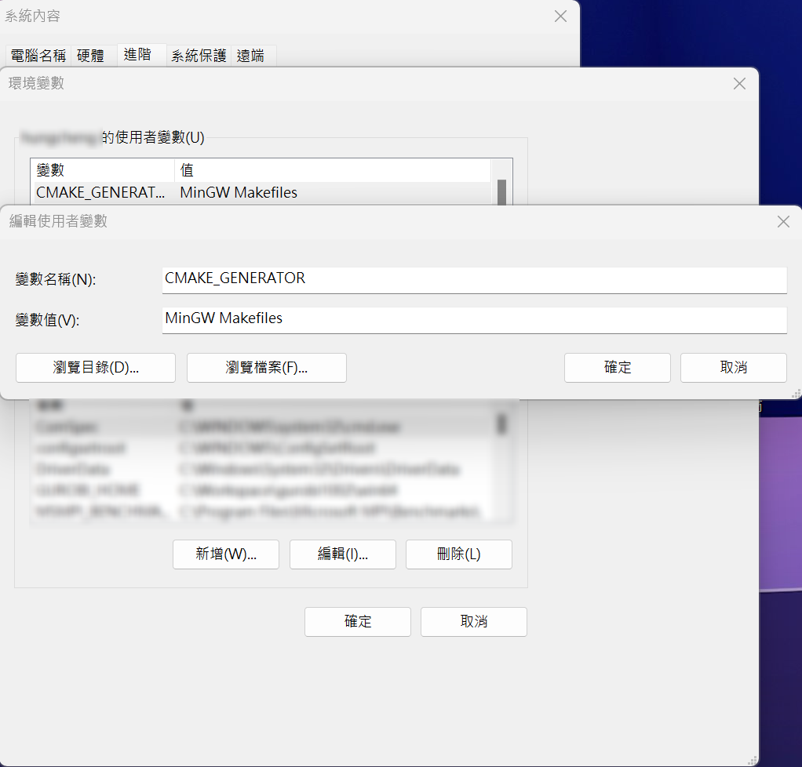

# 用python 調用 llama.cpp

本教程旨在指導讀者通過一個基於Python的封裝，逐步了解如何在本地機器上運行和利用llama.cpp，一個強大的C++庫，用於操作大語言模型。
# 安裝指南

## 使用 Ubuntu 或 Windows WSL
如果您使用的是 Ubuntu 或 Windows 的子系統（WSL），可以直接使用 PyPI 進行安裝：
```bash
    pip install llama-cpp-python
```
對於 Windows 子系統（WSL）的安裝方法，請[參考](https://learn.microsoft.com/zh-tw/windows/wsl/install)

## Windows 安裝注意事項
在 Windows 環境下通過 PyPI 安裝時，可能會遇到一些問題。請確保您已經安裝了 C 語言編譯器和 CMake。<br>

Windows 下 C 語言編譯器的安裝
詳細安裝指南請參見[此處](../Windows_Installation/README.md#windows下c語言編譯器的安裝)。

## 安裝 CMake
- 訪問 [CMake 官方網站](https://cmake.org/download/) 下載頁。
- 選擇 "Windows x64 Installer" 並下載。
- 在安裝過程中，請確保選中 "Add CMake to the system PATH for all users" 選項。

### 驗證CMake安裝成功：

在終端機中輸入以下命令並確認輸出與下方範例相符：
```bash
    cmake --version
```
預期輸出：
```bash
    cmake version 3.27.6

    CMake suite maintained and supported by Kitware (kitware.com/cmake).
```
### 設定 CMake 預設的 C 編譯器
在 Windows 中使用 CMake 時，可以通過 -G 選項指定生成器（generator）。例如，若要使用 "MinGW Makefiles" 生成器，輸入：
```bash
    cmake -G "MinGW Makefiles" [path to source]
```
但由於在使用 PyPI 進行安裝時無法指定生成器，我們需要將 "MinGW Makefiles" 設定為默認選項。這可以通過將 CMAKE_GENERATOR 環境變數加入系統環境變數來完成。

### 如何設定環境變數

1. 右鍵點選 "此電腦" 或 "電腦"，選擇 "屬性"。
2. 點擊 "進階系統設定"。
3. 在系統屬性視窗中，點擊 "環境變數"。
4. 在環境變數視窗中，點擊 "新建"，在系統變數區塊新增一個變數。
   - 變數名稱：`CMAKE_GENERATOR`
   - 變數值："MinGW Makefiles"
5. 點擊 "確定" 儲存設定。

以下是設定的示意圖：


