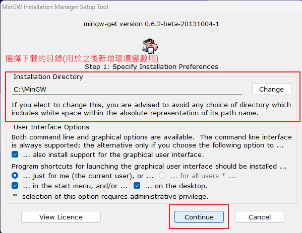
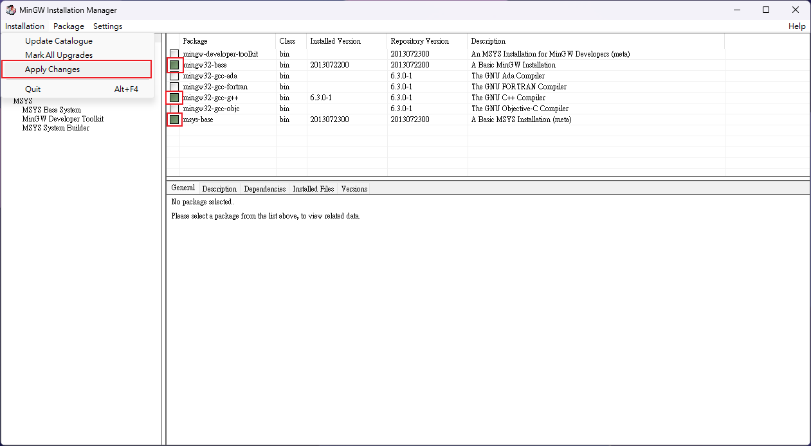
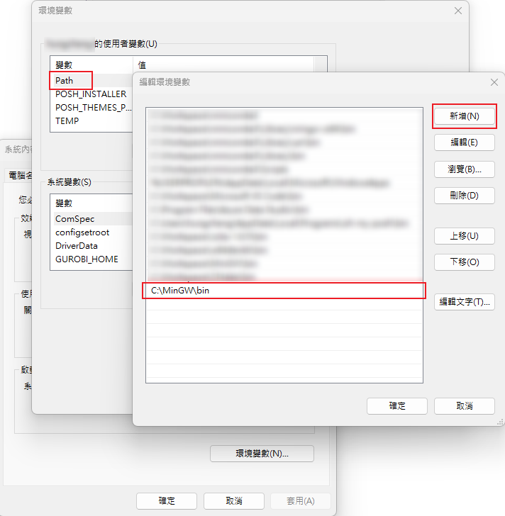
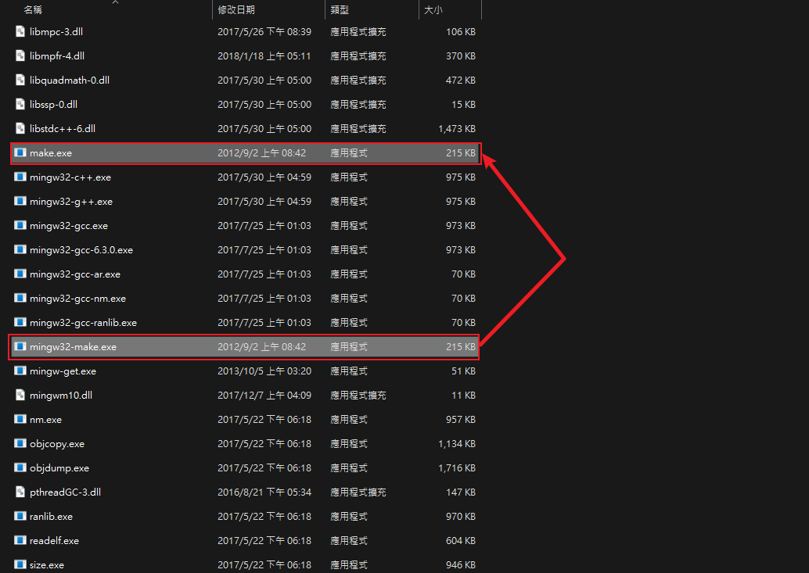
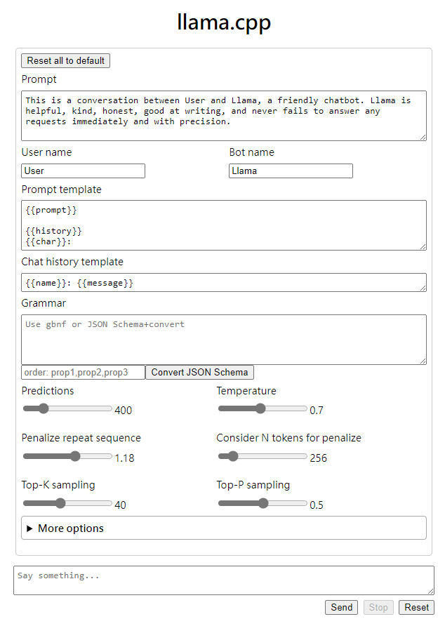

# 如何在Windows本地機器上使用Intel CPU運行中文大語言模型：llama.cpp安裝與配置指南

[llama.cpp](https://github.com/ggerganov/llama.cpp) 是一個用於在本地機器上使用CPU運行大語言模型的C++庫。本教程將一步步指導您從安裝到基本使用的整個過程。

## 目錄
- [開始](#開始)
- [Windows下C語言編譯器的安裝](#windows下c語言編譯器的安裝)
- [安裝llama.cpp步驟](#安裝llamacpp步驟)
- [加載並啟動模型](#加載並啟動模型)

## 開始
這些指南將幫助您在本地Windows機器上成功安裝並運行llama.cpp。

## Windows下C語言編譯器的安裝
1. **下載[MinGW](https://sourceforge.net/projects/mingw/)**
2. **安裝MinGW**
    - 運行`mingw-get-setup.exe`安裝程序
    - 選擇下載目錄並點擊`Continue`
    
3. **選擇下面的選項，點擊`Apply Change`**
    
4. **新增環境變數**
    - 把MinGW的路徑加入到環境變數中
    - 驗證安裝：在終端機中使用下方命令
    ```bash
    mingw32-make
    ```
    
5. **命令別名**
    - 在`MinGW\bin`路徑中複製`mingw32-make`，並將副本重新命名為`make`
    

[Note:順便設定好Cmake](../Python_Bindings/README.md#安裝cmake)

## 安裝llama.cpp步驟

### 1. **克隆存儲庫**
```bash
git clone https://github.com/ggerganov/llama.cpp
```

### 2. **構建項目**
- 切換到克隆下來的項目目錄並使用`make`命令構建項目。
```bash
cd llama.cpp
make
```

### 3. **下載模型權重**
- 我們將使用[中文LLaMA & Alpaca大模型](https://github.com/ymcui/Chinese-LLaMA-Alpaca-2/tree/main)的模型權重。這裡，我們以`中文7B的Alpaca`模型為例子。Alpaca模型具有接續上下文的能力，比較適合聊天（類似於ChatGPT）。您可以在[中文LLaMA & Alpaca大模型](https://github.com/ymcui/Chinese-LLaMA-Alpaca-2/tree/main)找到更多詳情。
```bash
cd llama.cpp
make
```

### 4. **創建模型目錄**
- 在`llama.cpp`目錄下創建一個新目錄來存放模型權重。您可以根據使用的模型大小（例如7B或13B）創建對應的目錄。
```bash
mkdir -p zh-models/7B
```

### 5. **下載完整模型**
- 我們將從Hugging Face下載完整的模型。由於文件體積較大，請耐心等待下載完成。
```bash
cd zh-models/7B
git clone https://huggingface.co/ziqingyang/chinese-alpaca-2-7b
```

### 6. **量化模型權重**
- 下載模型權重後，我們需要對模型權重進行量化。首先，回到`llama.cpp`目錄。
```bash
cd ../../llama.cpp
# 將 7B 模型轉換為 ggml FP16 格式
python3 convert.py models/7B/
# 將模型量化為 4 位元（使用 q4_0 方法）
./quantize ./zh-models/7B/ggml-model-f16.gguf ./zh-models/7B/ggml-model-q4_0.gguf q4_0
```
## 加載並啟動模型
請參閱官方詳細說明：[官方說明](https://github.com/ggerganov/llama.cpp/tree/master/examples/main)

### 命令行對話方式
```bash
cd llama.cpp
./main -m ./zh-models/7B/ggml-model-q4_0.gguf --color -f prompts/alpaca.txt -ins -c 2048 --temp 0.2 -n 256 --repeat_penalty 1.1
```

### Web介面方式
```bash
cd llama.cpp
.\server -m .\zh-models\7B\alpaca\ggml-model-q4_0.gguf -c 4096
```
啟動後，終端機將顯示本地網址 [http://127.0.0.1:8080](http://127.0.0.1:8080/)。通過此界面，您可以調整參數和提示詞等設置。



## 支持與貢獻

我們真誠地歡迎所有形式的支持和貢獻！這個項目能夠進一步發展和優化，很大程度上依賴於您寶貴的反饋和建議。

- **提交Pull Request**：如果您發現了一個錯誤或者您有改進的方法，請隨時提交一個PR！
- **創建Issue**：如果您在使用過程中遇到問題，或者有任何建議，請給我們留下一個Issue。

### 一起維護

我們相信，共同的努力將推動這個項目變得更加完善。無論您的貢獻是小是大，我們都將非常感激！

### 給我們一個⭐️

如果這個項目對您有幫助，請不要吝嗇您的支持——在我們的GitHub頁面頂部點擊⭐️按鈕，讓更多的人看到並使用這個項目！

感謝您的支持與關注！讓我們一起讓這個項目變得更好！
